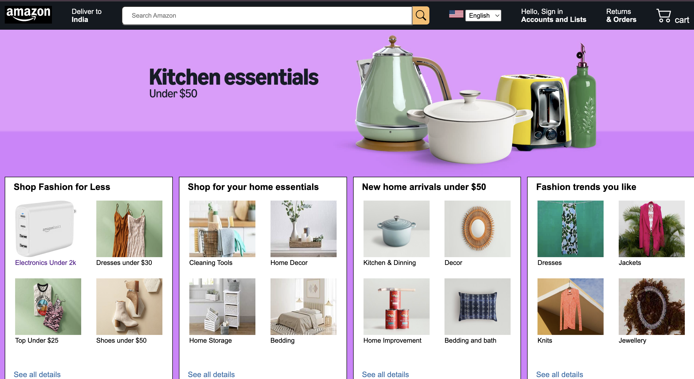
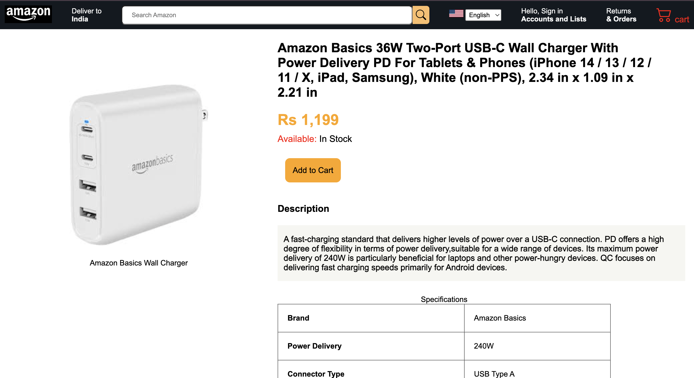
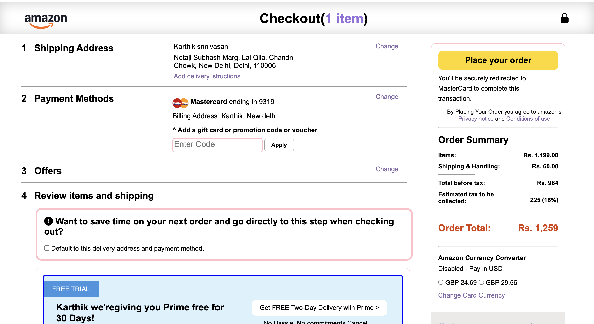
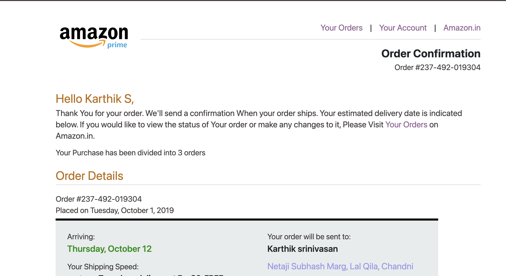

# Amazon-Inspired E-commerce Frontend

A complete multi-page e-commerce frontend application inspired by Amazon’s user experience.
This project was built **from scratch** to understand real-world frontend workflows such as
product browsing, cart, checkout, order confirmation, and authentication pages.

---

## 📌 Project Overview

This project focuses on recreating a realistic **e-commerce user journey** using only
core frontend technologies. The goal was to move beyond single-page layouts and
build a structured, scalable frontend system similar to production-level websites.

---

## 📸 Project Preview







---

## ✨ Features

- Multi-page e-commerce flow
- Home & product listing pages
- Product detail page
- Cart and checkout UI
- Order confirmation page
- Login & registration pages
- Responsive layout using Bootstrap
- Clean and consistent UI design

---

## 🛠 Tech Stack

- HTML5  
- CSS3 (Flexbox & Grid)  
- Bootstrap 5  
- JavaScript (basic DOM interactions)

---

## 🔮 Future Improvements

- Add JavaScript-based cart functionality
- Store cart data using localStorage
- Improve form validation
- Make the project fully responsive
- Integrate backend using Node.js


## 📂 Folder Structure

## 🚀 Live Demo
https://salaihhasan.github.io/amazon-inspired-ecommerce-frontend/

```text
amazon-inspired-ecommerce-frontend/
│── index.html
│── products.html
│── amzn_cart.html
│── confirmation-page.html
│── login_page.html
│── registration.html
│── nav.css
│── package.json
│── screenshots/
│   ├── home.png
│   ├── product.png
│   ├── checkout.png
│   ├── confirmation.png
│── README.md


## 👤 Author

**Md Salaih Hasan**  
Computer Science Engineering Student  
LinkedIn: https://www.linkedin.com/in/mdsalaihhasan 
GitHub: https://github.com/salaihhasan


## 📄 License

This project is for educational purposes only.
